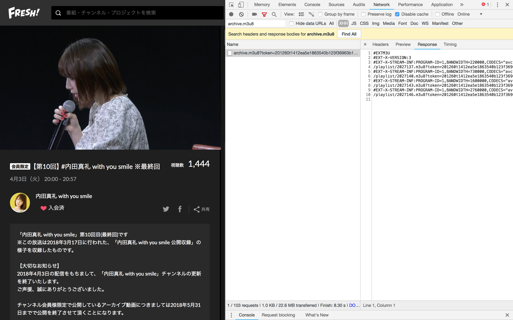
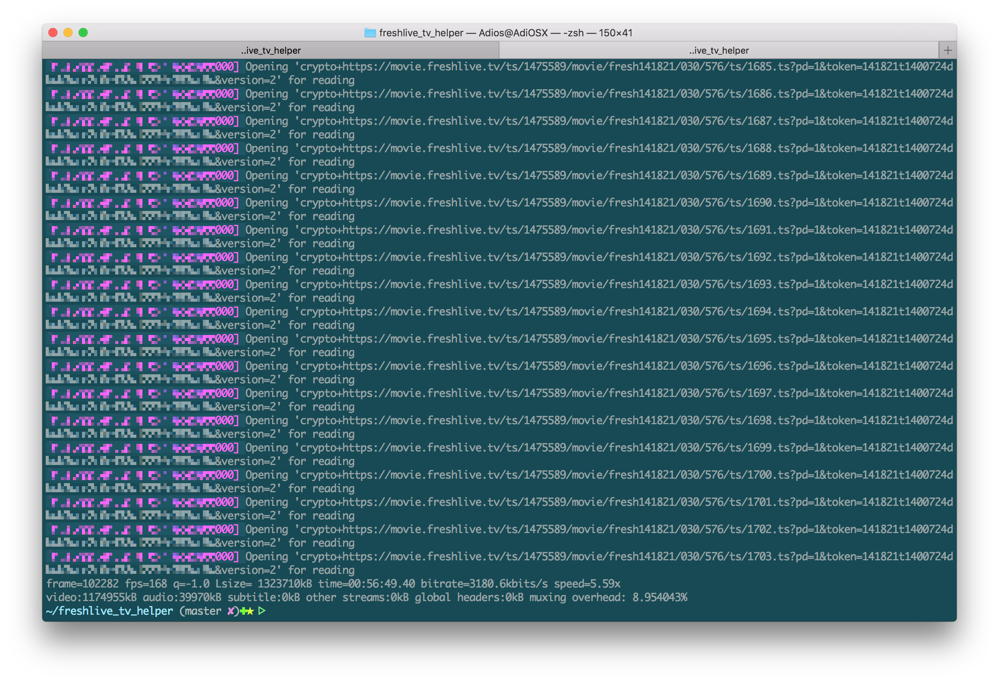
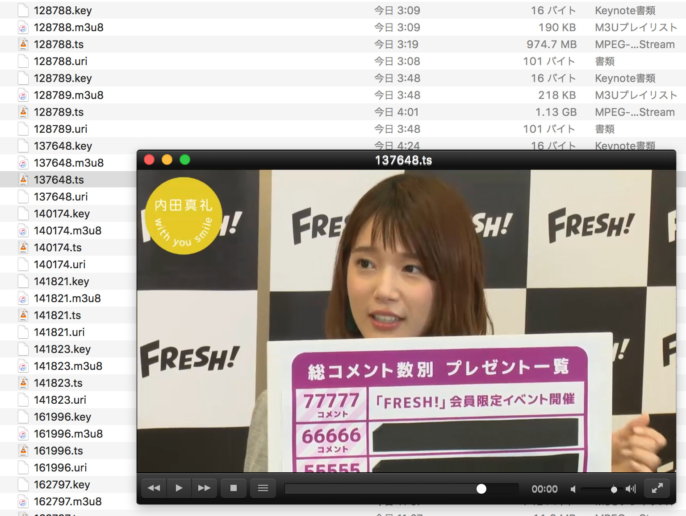

## Fresh!

There are various live channels on _[Fresh!](https://freshlive.tv/)_, and most programs of the channels, especially those **archived**, can only be accessed by channel subscribers.


The site implements the restriction by employing _HTTP Live Streaming Encryption_ with its **custom algorithm** on the contents. And that also refuses doing a simple `ffmpeg -i program.m3u8 -codec copy program.ts` because **_ffmpeg_ doesn't understand the custom algorithm in the m3u8**.

[freshlive_tv_helper]({{ site.github.repository_url }}) is here to transform the m3u8 to one that _ffmpeg_ understands.

For more details, please see the [README in the repository]({{ site.github.repository_url }}).

## The Quick Way

We first need your **program token** for the archived program you want in your subscribed channels.

1. Log into Fresh!.
2. Browse to the program you want to download.
3. Open the _web developer tool_ in your browser.
4. Look for something like the following:
    
    

The 43 chars string after `?token=` is your **program token**.

We are now able to download the program,
```bash
# Usage: ./run.sh YOUR_PROGRAM_TOKEN THAT_PROGRAM_URL
./run.sh 'NNNNNNtMMMMXXXXXXXXXXXXXXXXXXXXXXXXXXXXXXXX' 'https://freshlive.tv/uchidamaaya/201260'
```



For each program, 4 files will be created, named with the program ID. And the _.ts_ file is the video.



**Note that the `run.sh` is not well implemented yet. It may not work anytime after they update the system design.** The [Step-by-step instructions]({{ site.github.repository_url }}) are more reliable.
